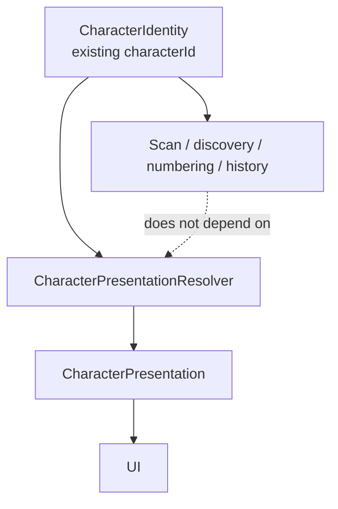

# Character Presentation Abstraction V1

Status: Phase 3A implementation / additive runtime abstraction / 2026-07-18

## 1. Purpose and boundary

Phase 3A lets scan, discovery, official numbering, certificates, dex, history, calendar, rediscovery, titles, worlds, and rarity development continue while new flagship art is unfinished. It does this by separating immutable game identity from display selection.

This is not an external-commission phase. It searches for no designer, contacts nobody, requests no estimate, creates no image, and approves no AI exploration. Phase 2A and Phase 2C decisions remain unchanged.

## 2. Measured existing flow

The current editing and generation route is:

1. `assets/characters/Character.xlsx` owns the human-edited legacy roster and permanent ID column.
2. `scripts/exportCharacterMaster.js` emits `character_master.json`.
3. `scripts/catalogBuild.js` combines master rows, classification, and asset discovery without deriving identity from rarity or image quality.
4. `scripts/generateCharacterData.js` emits the initial-only app catalog and static original/thumbnail manifests.
5. `scripts/generateServerSeed.js` emits the app-parity server seed.
6. `server/src/seed.ts` stores ID, name, rarity, world, and scan/dex eligibility. It does not seed a presentation image URL.

Before Phase 3A, `WorldDexScreen` read names and species directly from generated catalog entries; `MonsterDetailScreen` used catalog lookup; `MonsterAvatar` read the generated image manifest directly; `DiscoveryCertificateCard`, discovery log, and calendar read persisted display names. `SummonResultScreen` read `UserMonster.displayName`.

The server returns `characterName` in scan results and returns `name` plus the optional database `image_url` in `/api/dex`. The app's current discovery and detail rendering does not use that server image URL; it resolves static bundled images by `characterId`.

## 3. Identity versus presentation

`CharacterIdentity` is the game-domain identity. It carries the existing `characterId`, world, rarity, `releaseStatus`, discoverability, and the ID scopes used by official numbering and history. Phase 3A derives this read-only view from the generated catalog and does not mint or migrate an ID.

`CharacterPresentation` is UI-only data: display name, motif label, short description, original/thumbnail source, alt text, mode, presentation status, fallback reason, and provisional flag. It deliberately contains no rarity, `releaseStatus`, official number, discovery record, draw weight, or database operation.

There is no shared app/server package today. Presentation is an app-only concern and therefore lives in `src/types` and `src/services`; the server keeps its existing domain and DTO types.

## 4. PresentationMode

- `character`: existing character name and bundled official/legacy image presentation.
- `zoological`: future motif/species-centered presentation.
- `hybrid`: future character plus motif presentation.

The production default is `character` because that exactly corresponds to the display users saw before Phase 3A. No environment value, feature flag, setting, or user-facing switch changes it.

No approved zoological/hybrid presentation dataset exists. Requests for either mode therefore return the same default character presentation with an explicit fallback reason. They generate no species facts, character names, or image paths.

## 5. Resolver responsibilities

`resolveCharacterPresentation(characterId, mode)`:

- looks up an existing generated catalog entry;
- preserves the existing display name, species/motif label, description, original image, and thumbnail;
- returns `legacy` or `missing` presentation status independently of `releaseStatus`;
- returns `undefined` for an unknown ID rather than inventing content;
- falls back from undefined zoological/hybrid data to default character presentation;
- exposes alt text and a fallback reason for UI use.

It does not draw a character, choose rarity, change `releaseStatus`, decide scan eligibility, perform a draw, issue an official number, deduplicate a scan, update history, unlock legendary content, reveal secrets, access the database, or persist data.

## 6. Compatibility and migrated surfaces

The default path reuses the same generated catalog and generated static image manifest, so names, images, order, rarity/world labels, ownership state, official numbers, dates, counts, and certificates remain unchanged.

Migrated in Phase 3A:

- `WorldDexScreen`: card name, motif label, and image readiness use the resolver.
- `MonsterDetailScreen`: preview and owned-character name, motif label, and description use the resolver.
- `SummonResultScreen`: primary result and share-message character names use the resolver.
- `DiscoveryCertificateCard`: certificate name uses the resolver; discovery log and calendar inherit it.
- `MonsterAvatar`: bundled original/thumbnail lookup uses the resolver. All screens using this component inherit image abstraction.

Not migrated in this phase:

- home/recent labels, standalone `ShareCard`, and scan-history labels that render an existing `UserMonster.displayName`;
- server route response shapes, database `character_masters`, and server-side display-name storage;
- legacy family/rare displays outside generated character IDs;
- user settings or mode-selection UI.

Those paths continue to show their existing values. They can be migrated incrementally without changing identity.

Discovery and server-sync stores intentionally do not import the presentation resolver. They keep persisting the same authoritative IDs and display-name snapshots; presentation is applied only when a migrated UI renders those records.

## 7. Missing and invalid images

The generated manifest already omits nonexistent paths, and `MonsterAvatar` already had a non-image fallback visual. Phase 3A keeps that UI and adds an `Image.onError` transition, so a native decode failure switches to the same non-branded, text-based fallback instead of leaving the image surface unusable. No fallback is registered as official art.

`ground_sheep` remains a known exception: its 1024 × 1024 PNG exists and is statically required, but lacks the PNG IEND chunk. Its thumbnail is absent, so the current thumbnail helper falls back to the same damaged original. Metro/typecheck can resolve the existing file path, while `validate:release-assets` intentionally fails. Device decoding may reject the file; the new `onError` path then shows the text fallback. Phase 3A does not repair, replace, regenerate, resize, copy, or specially remap Sheep.

## 8. Future approved art integration

After a human designer delivers an approved baseline and rights/technical review is complete:

1. add the approved asset through the existing asset-generation source and procedure;
2. add approved presentation metadata in a separately reviewed presentation source;
3. mark presentation status `approved` without changing legacy `characterId`, rarity, `releaseStatus`, history, or number scope;
4. validate default compatibility, small-size assets, alpha/PNG integrity, manifests, and all affected UI;
5. introduce zoological/hybrid data only in a separate phase with explicit content provenance and release approval.

## 9. Rollback

Rollback is local to the app presentation layer: revert the Phase 3A UI imports and resolver files, returning `MonsterAvatar` and screens to their former direct catalog/manifest reads. No data rollback, database migration, ID remapping, seed change, history rewrite, or official-number repair is required because Phase 3A changes none of them.

## 10. Formal-data statement

Phase 3A changes no workbook, master, classification, generated catalog, generated image manifest, server seed, production image, thumbnail, ID, rarity, `releaseStatus`, database schema/migration, discovery history, certificate, official number, dependency, lockfile, or Phase 2A/2C external-designer document.
