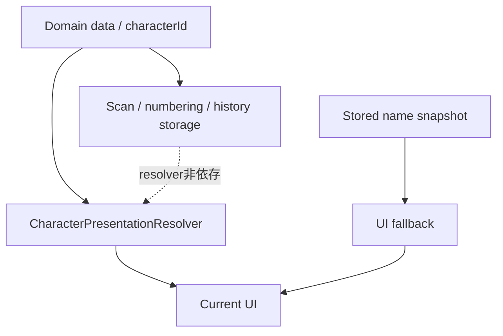

# Character Presentation Migration Completion V1

Status: Phase 3B implementation / additive UI migration / 2026-07-18

## 1. 目的とPhase 3Aからの継続

Phase 3Aで、ゲーム上の同一性である`CharacterIdentity`と、画面表示用の`CharacterPresentation`を分離した。Phase 3Bでは、その`CharacterPresentationResolver`を未移行のproduction UIへ段階的に適用し、現在のキャラクター名と画像の取得経路を統一する。

これは外部発注、デザイナー選定、画像生成、キャラクター案作成の工程ではない。正式画像、既存AI画像、キャラクター名、zoological／hybridの内容は作成・採用していない。

## 2. 監査方法

`src/screens`、`src/components`、`src/utils`、`src/services`、`src/stores`、`src/data`、`src/assets`、`server/src`を対象に、次を検索し、呼び出し元まで追跡した。

- `displayName`、`characterName`、`nameJa`、`nameEn`、nickname
- generated catalog、catalog lookup、character image／thumbnail manifest
- `require()`、`Image`、`MonsterAvatar`、アクセシビリティラベル
- Home、ShareCard、発見結果、発見証明、履歴、カレンダー、Friend QR、モーダル、共有テキスト
- store保存、server同期、抽選、採番、DB境界

文字列一致を一律置換せず、UIの現在表示、ドメイン処理、永続スナップショット、旧family／animation体系を区別した。

## 3. 監査結果（A〜D）

| 分類 | ファイル／参照 | 判断と対応 |
|---|---|---|
| A | `HomeScreen.tsx` 最近の発見名 | nicknameの既存優先を保ち、現在名をresolver経由へ移行。画像は既存の`MonsterAvatar`を継続。 |
| A | `ShareCard.tsx` 名前・画像 | nicknameの既存優先を保ち、名前をresolver経由へ移行。画像は`MonsterAvatar`の共通fallbackを使用。 |
| A | `ScanHistoryScreen.tsx` `UserMonster.displayName` | resolver現在名へ移行し、保存名をfallbackとして維持。履歴配列と日時は変更なし。 |
| A | `formStage.ts`／`CollectionScreen.tsx` | 姿接尾辞の前の基礎名だけをresolver経由へ移行。nickname、接尾辞、並び替えは維持。 |
| A | `FriendQRResultScreen.tsx` `record.characterName` | resolver現在名 → server記録名 → characterIdの順へ移行。番号とserver DTOは変更なし。 |
| A | `AwakeningReveal.tsx` generated画像manifest直接参照 | `MonsterAvatar`へ置換し、通常表示と同じ画像解決・デコード失敗fallbackを再利用。 |
| B | `MonsterAvatar.tsx` | Phase 3Aで画像resolverと`Image.onError`へ移行済み。Phase 3Bで未知IDの文字列fallbackを明確化。 |
| B | `WorldDexScreen.tsx`、`MonsterDetailScreen.tsx` | Phase 3Aで主要な名前・画像・説明を移行済み。共通表示名補助関数へ統一。catalog参照は図鑑番号、world、rarity等の既存メタデータ用。 |
| B | `SummonResultScreen.tsx` | Phase 3Aで結果名を移行済み。Phase 3Bで共通表示名補助関数へ統一し、説明もresolver経由へ整理。 |
| B | `DiscoveryCertificateCard.tsx` | Phase 3Aで移行済み。共通表示名補助関数へ統一。Discovery Log、Calendar、Homeの今日の一番はこのコンポーネントを再利用。 |
| C | `monsterStore.ts`、`authStore.ts`、`storageService.ts` | 発見、同期、オフライン保存、記録再構築の責務。resolverへ依存させない。 |
| C | `monsterGenerator.ts`、`worldSpawn.ts`、`discoveryRecordService.ts`、`numberValue.core.ts` | 抽選、生成、採番、証明記録のドメイン処理。表示resolverの対象外。 |
| C | `WorldListScreen.tsx`のcatalog | normal完成判定と解放表示のためのドメイン入力であり、表示名・画像取得ではない。 |
| C | `ResearchScreen.tsx`のfamily名、profile／friendの`displayName` | characterId presentationではなく、旧family研究または人間ユーザー／フレンド名。 |
| C | `CollectionScreen.tsx`の`TOTAL_INDIVIDUAL_VARIANT_GOAL` | 画像取得ではなく既存の数値定数。 |
| D | `UserMonster.displayName` | server／生成時の名前を含めて端末へ永続保存される。オフライン・未知IDのfallbackとして残す。削除・書換えなし。 |
| D | `DiscoveryRecord.characterName` | ログ／カレンダーでjoin不要にする記録時名称の複製。保存値は維持し、移行UIでは現在名が解決できない場合のfallbackにする。 |
| D | `MyPageScreen.tsx`、duplicate／researchのfamily画像 | 旧family単位の意図的表示。characterId画像へ変えると現在の見た目が変わるため未移行。 |
| D | `DiscoveryRevealScreen.tsx`／`DiscoveryCoreAnimation.tsx` | navigationへ登録されていない受け取り型の旧コンポーネント。production経路ではなく、API変更を避けて未移行。 |
| D | `CharacterMotionPlayer.tsx`、form画像asset | 専用フレーム／姿assetの別レイヤー。generated character manifestの直接表示とは異なるため未変更。 |

## 4. Home

最近の発見は従来どおり`monsters.slice(0, 6)`で、filter、sort、reverseを追加していない。件数は最大6件、store順、押下先の`monster.id`、発見回数、日時を維持した。名前だけをnickname → resolver現在名 → 保存済み`displayName` → characterIdの順にし、画像は`MonsterAvatar`を継続した。カードへ名前を含むアクセシビリティラベルを追加した。

先頭のプロフィール画像、今日の一番発見、図鑑件数、履歴件数、ワールド、DPには変更がない。今日の一番は既存の`DiscoveryCertificateCard`経由でresolver適用済みである。

## 5. ShareCardと共有表示

単独`ShareCard`は、既存のnickname優先を維持し、その次をresolver現在名 → 保存名 → characterIdにした。画像、種族ラベル、星、属性、図鑑進捗、レイアウトは変更していない。共有カード全体に名前を含むアクセシビリティラベルを追加した。

ShareCard自体は以前から公式番号や正確な発見日時をpropsとして受け取らず、今回も責務を拡張していない。周辺の`SummonResultScreen`では、共有テキストの公式番号、難度、番号バッジ、rarity、図鑑進捗、`Share.share`導線を維持した。発見証明の日時、world、番号は`DiscoveryRecord`／`DiscoveryCertificateCard`に残る。

## 6. UserMonster.displayNameと表示値の優先順位

`UserMonster`全体はAsyncStorageへ保存され、`displayName`はserverの`characterName`または発見時catalog名を保持する。現在はcatalog名の複製であることが多いが、オフライン表示、旧データ、未知ID、server互換のfallbackとして意味がある。型、store、DTO、保存済み値を削除・上書きしていない。

現在表示の共通優先順位は次のとおり。

1. 画面が従来nicknameを表示していた場合はnickname
2. resolverの現在`displayName`
3. 保存済み`UserMonster.displayName`または`DiscoveryRecord.characterName`
4. `characterId`／`imageKey`
5. IDも無い場合だけ「キャラクター」

姿表示はこの基礎名の後に既存の姿接尾辞を付ける。発見証明では、Phase 3Aからの挙動どおりresolver現在名を優先し、記録時名称はfallbackとして保持する。保存済みの証明内容そのものは更新しない。

## 7. 画像fallbackとアクセシビリティ

画像はresolverの正式／legacy画像またはサムネイル → 非catalog旧画像 → `MonsterAvatar`の非ブランド文字fallbackの順で扱う。`Image.onError`後は同じsourceを再描画しないため、破損画像の再試行ループにならない。不明な画像キーではfamilyを推測せず、そのキーを最低限の識別文言として表示する。

`ground_sheep`は依然として原画PNGのIENDが欠損している。ファイル、manifest、サムネイルを修復・差替え・削除していない。Home、ShareCard、履歴、出現演出を含む`MonsterAvatar`利用箇所は、デコード失敗時に共通fallbackへ移る。

Phase 3BではHome最近カード、ShareCard、ScanHistory、AwakeningRevealへ識別可能なアクセシビリティラベルを追加した。`MonsterAvatar`はresolverのalt textを継続し、不明IDでもID文字列を使用する。未発見図鑑の`???`と既存読み上げは変更していない。

## 8. server、設定、PresentationMode

serverレスポンス、server DTO、DB schema、DB migration、seedを変更していない。serverの`characterName`は今回削除せず、appの保存fallbackとして維持する。将来不要と判断する場合も、API互換性を扱う別Phaseで検討する。

設定画面へモード切替や開発者向けpresentation設定を追加していない。production defaultは`character`のまま。正式データがない`zoological`と`hybrid`は未公開で、従来どおり`character`へfallbackする。

## 9. 移行完了ガード

`tests/characterPresentationMigration.test.ts`で次を自動検査する。

- Homeの先頭6件、store順、詳細遷移ID、共通名／画像経路
- ShareCardの共通名／画像経路、共有導線、公式番号文字列
- screens／components／formStageに`monster.displayName`の直接UI参照が再導入されていないこと
- production screens／componentsがgenerated character image manifestを直接importしないこと
- UserMonsterとDiscoveryRecordの保存名フィールドが残ること
- 発見、同期、抽選、採番、serverがpresentation resolverへ依存しないこと
- default modeが`character`で、設定画面にモードUIがないこと

catalogの正当なドメイン利用、resolver自身、旧family／motion assetは違反対象にしない。

## 10. 正式データ、残課題、ロールバック

Phase 3BはCharacter.xlsx、master、classification、461 ID、89 initial、rarity、`releaseStatus`、generated catalog、asset manifest、server seed、正式画像、正式サムネイル、発見履歴、発見証明、公式番号、DB、依存関係、lockfile、Phase 2文書を変更しない。

残課題は、旧family単位のMy Page／research／duplicate表示、未接続の旧DiscoveryReveal API、animation／form専用assetの将来統合である。これらは現在表示や別のID意味を変えるため、Phase 3Bでは移行しない。

ロールバックはPhase 3Bコミットだけをrevertし、各UIをPhase 3A時点の保存名または直接manifest参照へ戻す。データ移行、DB rollback、ID修復、履歴書換えは不要である。
